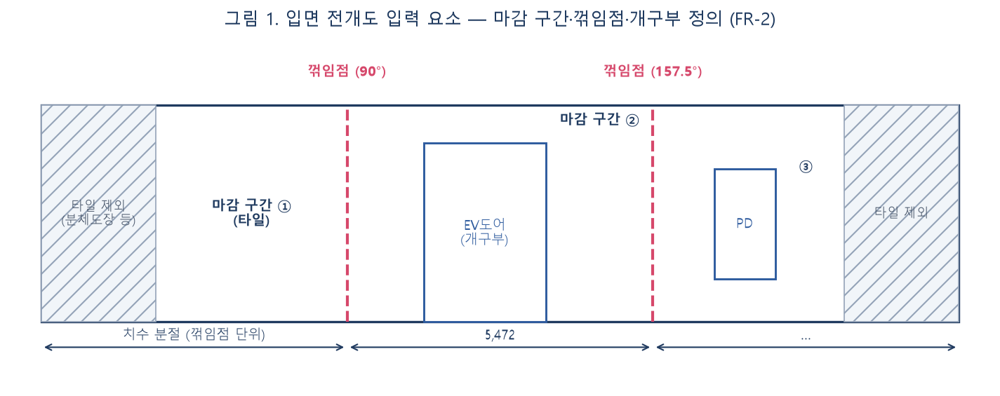
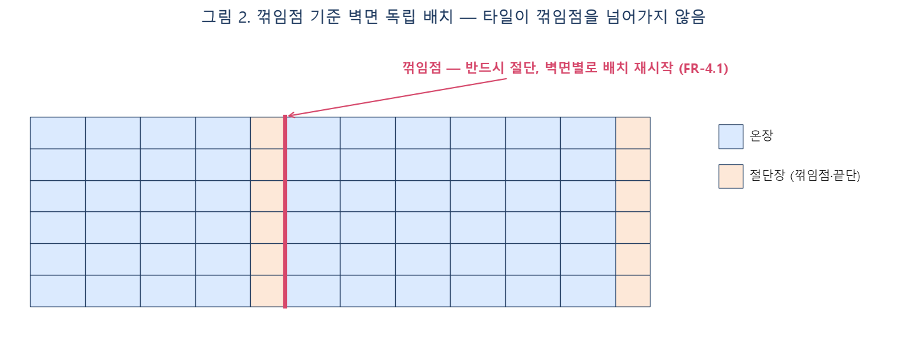
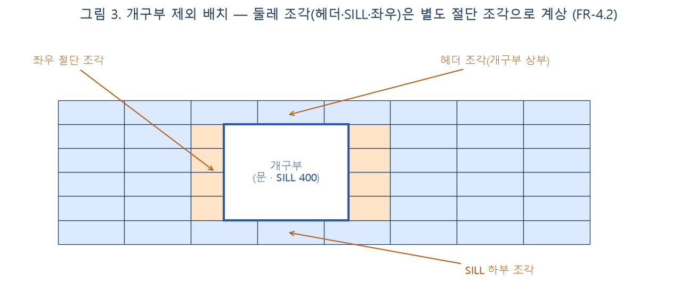
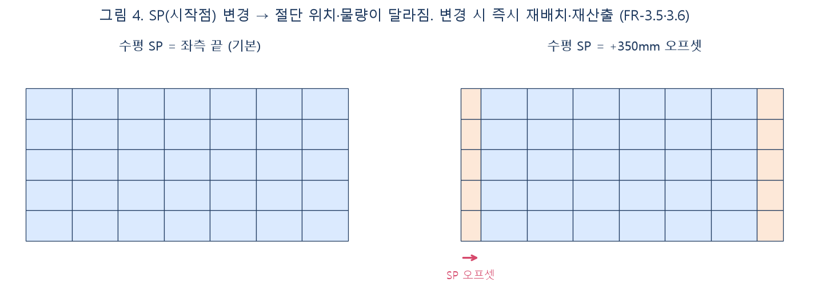
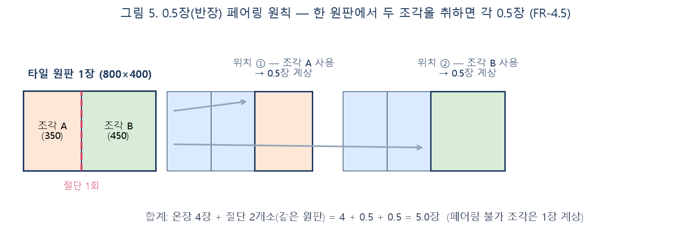

# E/V홀 타일나누기도 자동화 — 개발요구명세서

> 작성: 2026-07-08 · 최종 수정: 2026-07-08 · 상태: 진행중(업체 협의용 초안)
> 발주: 우미건설 스마트건설팀 · 수신: 개발 용역사
> 관련 시스템: 오토콘(AutoCon) 시공상세도 자동화 플랫폼 — 기 운영 중인 **단열재 나누기도** 도구의 자매 도구

---

## 1. 개요

### 1.1 배경·목적

공동주택 E/V홀(엘리베이터홀) 벽체 타일 마감의 **타일나누기도(타일 분할 배치도) 작성과 물량 산출을 자동화**한다.
현재는 설계사/시공사가 CAD에서 수작업으로 나누기도를 그리고 장수를 손으로 세고 있으며, SP(시작점)나 타일 규격이 바뀌면 전량 재작업이 발생한다.

기 운영 중인 **단열재 나누기도** 도구와 배치·산출 로직의 골격은 동일하나, 다음 근본 차이가 있다.

| 구분 | 단열재 나누기도 (기존) | E/V홀 타일나누기도 (본 건) |
| --- | --- | --- |
| 입면의 출처 | 평면도에서 벽선을 따서 입면을 **생성** | **입면 전개도가 도면으로 이미 주어짐** |
| 배치 영역 | 생성한 전개면 전체 | 주어진 전개도 내 **타일 마감 구간만** (분체도장·화강석 등 타 마감 구간 제외) |
| 코너 | 평면 폴리라인 꼭짓점에서 자동 산출 | 전개도에 표기된 **꺾임점** 인식/지정 |
| 개구부 | 사용자가 프리셋으로 입력 | 전개도에 **이미 그려져 있는 개구부** 인식/지정 |
| 계상 단위 | 판(장) + 조각 재사용 | 장 + **0.5장(반장) 원칙** |
| 검산 | 없음 | **기존(수작업) 나누기도의 장수 카운트** 기능 필요 |

### 1.2 대표 예시 도면

`A-TYPE 지상층 주출입구 ELEV홀 입면 전개도` 유형 (발주처 제공 샘플 도면 참조):

- 전개도 한 장에 여러 벽면이 펼쳐져 있고 상부 치수(예: 1,600 / 3,451 / 5,472 / 3,451 / 1,600)가 **꺾임점 단위로 분절**되어 있음. 꺾임점 위치에 각도 표기(예: 157.5°)와 마크가 있음
- 벽 높이 예: 2,550 (좌측 치수: 250 + 400×5 + 200 등 — 상·하단 절단행 존재)
- 개구부: EV도어, 출입문, PD/EPS/TPS 점검구, FSD 등이 전개도 안에 그려져 있음
- 마감 구간 혼재: `지정 타일(A)(800X400)` 구간과 분체도장·화강석 물갈기 구간이 한 전개도 안에 병존
- 기존 수작업 나누기도에는 온장에 일련번호(1, 2, 3, …)가, 절단 조각에 `0.5` 표기가 붙어 있음

### 1.3 개념 모식도

핵심 요구사항의 오해를 막기 위한 개념도. 상세 요건은 각 FR 참조.

**그림 1 — 입면 전개도 입력 요소 (FR-2)**: 주어진 전개도에서 마감 구간·꺾임점·개구부를 정의한다.

**그림 2 — 꺾임점 독립 배치 (FR-4.1)**: 꺾임점에서 반드시 절단, 벽면별 배치 재시작.

**그림 3 — 개구부 조각 처리 (FR-4.2)**: 개구부 둘레(헤더·SILL·좌우) 조각은 별도 절단 조각으로 계상.

**그림 4 — SP(시작점) 개념 (FR-3.5·3.6)**: SP 변경 → 절단 위치·물량 변화, 즉시 재산출.

**그림 5 — 0.5장(반장) 페어링 (FR-4.5)**: 한 원판에서 두 조각을 취하면 각 0.5장 계상.

### 1.4 기대 산출물(용역 범위)

1. 웹 기반 타일나누기도 자동화 도구 (오토콘 플랫폼 탑재형 — 8장 기술 요건 참조)
2. 본 명세의 배치·산출 로직 구현 및 검수 통과
3. 소스코드·기술문서 일체 납품

---

## 2. 용어 정의

| 용어 | 정의 |
| --- | --- |
| 전개도 | E/V홀 내벽을 한 평면에 펼쳐 그린 입면도. 본 도구의 **입력 도면** |
| 벽면(세그먼트) | 꺾임점~꺾임점 사이의 한 벽. 나누기의 **독립 단위** |
| 꺾임점 | 평면상 벽이 꺾이는 위치가 전개도에 투영된 수직 경계. 이 지점에서 타일은 반드시 절단되고, 좌우 벽면은 서로 독립 배치 |
| 개구부(오프닝) | 문·EV도어·PD/점검구 등 타일을 붙이지 않는 사각 영역 |
| 마감 구간 | 전개도 안에서 타일을 실제로 붙이는 범위. 타 마감(도장·석재) 구간과 경계로 구분 |
| SP(Start Point, 시작점) | 타일 배치의 기준점. 수평 SP(좌우 어디서부터 깔기 시작하나)·수직 SP(바닥/천장 어느 행부터 온장인가)로 구성 |
| 온장 | 절단 없이 쓰는 정규격 타일 1장 |
| 절단장 | 규격보다 작게 잘라 쓰는 타일 |
| 0.5장(반장) 원칙 | 타일 1장을 잘라 **두 위치에 나눠 쓸 수 있으면 각 위치를 0.5장으로 계상**하는 물량 산출 원칙 (한 장에서 두 조각이 나오는 경우) |
| 버림(폐기) | 절단 후 남은 자투리 중 재사용 불가한 부분 |
| 나누기도 | 벽면에 타일 셀 경계·번호를 그린 배치도 |
| REV | 저장 리비전. 입력값+결과를 함께 보관하는 스냅샷 |

---

## 3. 시스템 범위·전제

- 대상 부위: 공동주택 **E/V홀 벽체 타일** (지상층 주출입구 홀, 기준층 홀 등). 바닥타일은 본 용역 범위 외(단, 확장 가능한 구조로 설계할 것)
- 입력 도면 형식: **DXF** (AutoCAD R12 이상 ASCII 우선. DWG 직접 지원은 협의 항목)
- 언어: UI·문서 전부 **한국어**
- 좌표·치수 단위: **mm 정수 기준** (내부 계산은 부동소수 허용하되 표시·집계는 mm 반올림, 오차 누적 금지)
- 화면에 보이는 배치 결과와 저장·산출 데이터는 **반드시 일치**해야 함 (동일 입력 → 동일 출력의 결정적 알고리즘)

---

## 4. 기능 요구사항

### FR-1. 프로젝트·부위 관리

| ID | 요구사항 |
| --- | --- |
| FR-1.1 | 프로젝트(현장) 생성·조회·삭제. 프로젝트 안에 **동(棟) → 타입(A/B/…) → 부위(예: 지상층 주출입구 홀, 기준층 홀)** 계층으로 나누기도를 관리한다 |
| FR-1.2 | 부위별 나누기도는 **REV(리비전) 단위로 저장/불러오기** — 입력값(도면·설정·SP)과 결과(배치·물량)를 함께 보관 |
| FR-1.3 | 타입별 결과에 **적용 개소 수**(예: A타입 기준층 홀 × 12개층 × 2개동)를 곱해 동·단지 합계 물량을 집계할 수 있어야 한다 |
| FR-1.4 | 프로젝트 파일 내보내기/불러오기(JSON — 상태+원본 DXF 동봉)로 사용자 간 파일 전달 가능 |

### FR-2. 도면 입력·영역 정의

| ID | 요구사항 |
| --- | --- |
| FR-2.1 | DXF 업로드 → 전개도 미리보기 캔버스 표시 (줌/팬 지원) |
| FR-2.2 | **배치 영역(마감 구간) 지정**: 사용자가 전개도 위에서 타일 적용 범위(외곽 사각/폴리곤)를 지정한다. 도면 레이어·폐폴리라인 기반 자동 후보 제시는 가점 사항이며, **수동 지정이 항상 가능해야 함** (자동 인식 실패가 작업 불가로 이어지면 안 됨) |
| FR-2.3 | **꺾임점 정의**: 전개도 치수 분절·꺾임 마크 기반 자동 후보 제시 + 사용자가 X좌표로 추가/이동/삭제. 꺾임점마다 평면 각도(예: 90°, 157.5°)를 속성으로 입력 가능(코너 마무리 판단용 참고 정보) |
| FR-2.4 | **개구부 정의**: 전개도에 그려진 개구부를 사각 영역으로 지정(자동 후보 + 수동). 속성: 종류(출입문/EV도어/PD·점검구/FSD/기타), 위치(x, y), 폭×높이, SILL 높이. 자주 쓰는 규격은 **프리셋으로 등록·수정** 가능 |
| FR-2.5 | 타일 제외 구간(분체도장·석재 등 타 마감 구간)을 별도 영역으로 지정 — 배치·물량에서 완전히 제외 |
| FR-2.6 | 영역·꺾임점·개구부 지정 상태는 캔버스에 색·라벨로 항상 시각화 |

### FR-3. 타일 규격·배치 설정

| ID | 요구사항 |
| --- | --- |
| FR-3.1 | 타일 규격 입력: 폭×높이(mm) (예: 800×400, 600×600). 규격 프리셋 등록·수정 |
| FR-3.2 | 줄눈 폭(mm) 입력 — 배치 피치는 `타일 규격 + 줄눈` 기준. 0 허용 |
| FR-3.3 | 붙임 방향: 가로깔기/세로깔기(규격 회전) 선택 |
| FR-3.4 | 패턴: 통줄눈(stack) 기본. 엇줄눈(running)은 옵션으로 제공 |
| FR-3.5 | **SP 지정**: ① 수평 SP — 벽면별 기준(좌측 끝/우측 끝/중앙 정렬/임의 오프셋 mm) ② 수직 SP — 기준(바닥 온장/천장 온장/임의 오프셋 mm). 기본값: 사용자 설정으로 프로젝트 공통 저장 |
| FR-3.6 | SP·규격·줄눈 등 설정 변경 시 **즉시 재배치·재산출** (수동 "다시 계산" 버튼 불필요) |
| FR-3.7 | 최소 조각 폭(mm) 옵션: 이보다 좁은 절단 조각이 생기면 옆 타일과 합쳐 균등 재분할(조각 자체가 안 생기게). 0=끔 |
| FR-3.8 | 버림 기준 폭(mm) 옵션: 이보다 좁은 자투리는 '버림' 표기(물량 손실로 집계). 0=끔 |

### FR-4. 배치(나누기) 로직 — 핵심

| ID | 요구사항 |
| --- | --- |
| FR-4.1 | **벽면 독립 배치**: 꺾임점에서 타일을 반드시 절단하고, 각 벽면은 자기 SP 기준으로 독립적으로 배치한다. 타일이 꺾임점을 넘어 이어지면 안 됨 |
| FR-4.2 | **개구부 제외**: 개구부 영역과 겹치는 타일은 겹침 부분을 절단 제외. 개구부 좌우·상부(헤더)·하부(SILL 아래) 조각은 각각 별도 절단 조각으로 계상 |
| FR-4.3 | 마감 구간 경계에서도 FR-4.1과 동일하게 절단 |
| FR-4.4 | 행(수평 줄) 단위 배치: 수직 SP 기준으로 행 그리드를 만들고, 각 행을 수평 SP 기준으로 채운다. 상·하단 절단행(예: 높이 2,550에 400 모듈 → 250·200 절단행) 자동 처리 |
| FR-4.5 | **0.5장 페어링**: 절단 조각 산출 시, 한 장(원판)에서 두 조각을 취할 수 있는 조합(두 조각의 소요 폭 합 ≤ 원판 폭, 높이 동일 또는 재단 가능)을 자동 페어링하여 각 0.5장으로 계상한다. 페어링 불가 조각은 1장으로 계상(잔여는 버림). 페어링 결과(어느 조각끼리 한 장인지)를 조회할 수 있어야 함 |
| FR-4.6 | 배치 결과 셀마다 번호 부여: 온장은 일련번호(1, 2, 3 …), 절단 조각은 기존 수작업 관례에 맞춰 `0.5` 또는 `N-1`/`N-2`(같은 원판 페어) 방식 중 설정 선택 |
| FR-4.7 | 동일 입력에 대해 항상 동일 결과(난수·순서 비결정성 금지) |

### FR-5. 기존 나누기도 검산(카운트)

| ID | 요구사항 |
| --- | --- |
| FR-5.1 | **이미 그려진(수작업) 나누기도 DXF를 읽어 장수를 집계**한다: 타일 셀 경계(폴리라인/해치)와 번호 텍스트를 인식하여 온장 수·절단 조각 수·0.5 표기 수를 카운트 |
| FR-5.2 | 인식 결과를 캔버스에 오버레이로 표시하고, 오인식 셀은 사용자가 수동으로 포함/제외/수정할 수 있어야 함 |
| FR-5.3 | 검산 리포트: 기존 도면 카운트 vs 시스템 자동 배치 결과 **비교표**(온장/절단/0.5/버림/총장수 차이) |

### FR-6. 물량 산출

| ID | 요구사항 |
| --- | --- |
| FR-6.1 | 집계 단위: 벽면별 → 부위별 → 타입별 → 동별 → 프로젝트 합계 |
| FR-6.2 | 집계 항목: 온장 수, 절단장 수(0.5장 단위 반영), 버림 수, **총 소요장수**, 시공 면적(㎡), 타일 원판 면적 대비 손실률(%), 개구부 공제 면적 |
| FR-6.3 | 할증률(%) 입력 → 발주 수량 산출 (총 소요장수 × (1+할증), 올림 단위 설정: 장/박스. 박스당 입수 입력) |
| FR-6.4 | 화면 표와 저장 데이터·내보내기 결과의 수치는 항상 동일 |

### FR-7. 출력

| ID | 요구사항 |
| --- | --- |
| FR-7.1 | 나누기도 **DXF 내보내기**: 벽면별 전개 배치도 + 셀 경계 + 번호 라벨 + 치수 + 범례. 레이어 분리(타일경계/번호/개구부/치수/버림표기 등, 레이어명 협의) |
| FR-7.2 | **물량표 내보내기**: Excel(xlsx) 또는 CSV — FR-6 집계 전 항목 |
| FR-7.3 | 캔버스 화면 인쇄/이미지(PNG) 저장 — A3 기준 비율 유지 |
| FR-7.4 | 절단 상세: 번호 클릭 시 해당 원판의 절단 배치도(어느 조각들이 한 장에서 나오는지)와 조각 치수표 팝업, 같은 원판 조각들 캔버스 하이라이트 (단열재 도구 기 구현 UX와 동일 수준) |

---

## 5. 비기능 요구사항

| ID | 요구사항 |
| --- | --- |
| NFR-1 | 성능: 전개도 1면(타일 셀 500개 수준) 기준 설정 변경 → 재배치·재산출 **1초 이내** |
| NFR-2 | 정밀도: mm 단위 정합. 행·열 누적 오차로 마지막 셀 치수가 틀어지지 않을 것 |
| NFR-3 | 브라우저: 최신 Chrome/Edge 데스크톱 기준 |
| NFR-4 | 저장 실패·도면 파싱 실패 시 사용자에게 복구 가능한 한국어 안내 제공 (작업 내용 유실 금지) |
| NFR-5 | 코드: TypeScript, 배치·산출 로직은 UI와 분리된 순수 함수 모듈로 작성(단위테스트 가능 구조) |

---

## 6. 검수 기준 (Acceptance Criteria)

발주처가 제공하는 **샘플 도면 세트(수작업 나누기도 완성본 포함, 3개 타입 이상)** 기준:

1. 샘플 전개도에 대해 영역·꺾임점·개구부 지정 후 자동 배치 결과가 수작업 나누기도와 **동일 원칙(SP·규격 동일 조건)에서 총장수 오차 0** — 차이 발생 시 비교 리포트로 원인(SP 차이 등)이 설명 가능해야 함
2. SP를 변경하면 배치·번호·물량이 즉시 갱신되고, 동일 SP로 되돌리면 원결과와 완전 일치
3. 기존 나누기도 카운트 기능이 샘플 완성본의 번호·0.5 표기를 95% 이상 자동 인식하고, 나머지는 수동 보정으로 100% 집계 가능
4. 0.5장 페어링: 페어 조회 시 두 조각 폭 합이 원판 폭 이내임이 전 케이스에서 성립
5. DXF 내보내기 결과가 AutoCAD에서 정상 열람되고 레이어 규칙 준수
6. REV 저장→불러오기→재산출 시 수치 완전 일치

---

## 7. 단열재 나누기도와의 공통 로직 (참고)

기 운영 도구에서 검증된 다음 개념을 그대로 차용한다 (동작 정의가 모호할 경우 기존 도구 동작을 기준으로 협의):

- 배치 정책 2모드: **손실 최소**(자투리를 옆 판과 합쳐 균등 분할) / **시공성 우선**(온장 유지, 기준폭 미만 자투리 버림) — 타일은 시공성 우선이 기본
- 최소 조각 폭(재분할)·버림 기준 폭 옵션 (FR-3.7·3.8)
- 셀 번호 라벨링, 원판 단위 절단 배치(길로틴 컷) 상세 팝업, 그룹 하이라이트
- REV 저장(입력+결과 동봉), 프로젝트 파일(.json, 상태+DXF 동봉) 이동
- 캔버스 휠 줌(0.2~50x)/드래그 팬/더블클릭 리셋

---

## 8. 기술·통합 요건 (협의 항목)

- 목표 플랫폼: **오토콘(AutoCon)** — pnpm 모노레포(React 19 + Vite + TypeScript + Tailwind v4 / Cloudflare Workers(Hono) / Supabase)
- 납품 형태(택1, 계약 시 확정): ① 오토콘 저장소 내 신규 도구 모듈로 직접 개발 ② 독립 모듈 납품 후 발주처 통합
- 인증: 오토콘 기존 로그인(DCR 계정) 체계 사용 — 별도 회원 체계 구축 금지
- 데이터 저장: Supabase(DB=REV·프로젝트 메타, Storage=DXF 원본) — 기존 `elev_projects`/`elev_revisions` 스키마 패턴 준용
- DXF 파싱/생성: 파싱 `dxf-parser`(또는 동등 라이브러리), 생성은 AutoCAD R12 ASCII 직접 생성 방식 권장 (기존 도구와 동일)
- UI 텍스트·주석 한국어, 우미 브랜드 톤(#004791 계열) 준수

---

## 9. 범위 외 (Out of Scope)

- 바닥/천장 타일 나누기 (확장 고려만)
- DWG 바이너리 직접 파싱 (DXF 변환 전제)
- 3D 시각화
- 자재 발주·단가 연동 (물량표까지가 범위)

## 10. 발주처 제공 자료

- 샘플 입면 전개도 DXF (타입별 3종 이상, 수작업 나누기도 완성본 포함)
- 기존 단열재 나누기도 도구 시연·소스 열람 (통합 방식 협의 시)
- 타일 규격·개구부 프리셋 초기값 목록

## 11. 미결정·협의 필요 사항

| 항목 | 내용 |
| --- | --- |
| 납품 형태 | 8장 ①/② 중 택1 |
| 자동 인식 수준 | 영역·꺾임점·개구부 자동 인식은 "후보 제시" 수준이 최소 요건. 완전 자동화 목표 수준·정확도 기준은 샘플 도면 검토 후 확정 |
| 번호 표기 방식 | `0.5` 단독 표기 vs `N-1/N-2` 페어 표기 기본값 |
| 줄눈 반영 방식 | 줄눈 포함 피치 배치 vs 줄눈 무시(맞댐) — 현장 시공 기준 확인 후 확정 |
| DXF 레이어 규칙 | 발주처 CAD 표준 레이어명 수령 후 확정 |
